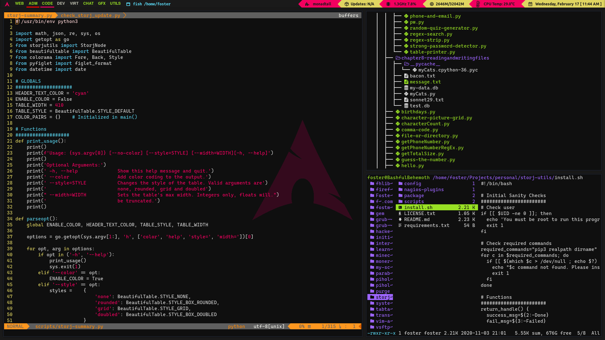
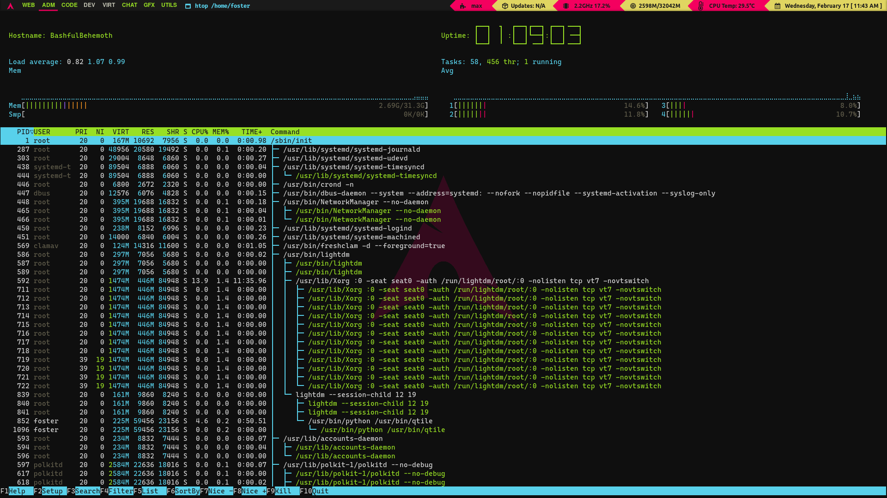

# Overview
Dotfiles are configuration files used to customize the look and behaviour of a UNIX-based system. The configuration files contained within this repository belong to me and I share it to the public in the hope that someone may find it useful. I advise that you first attempt to understand the contents of the files before applying any of the settings to your own configuration. I am not liable for any damages that may occur from the use of my configuration files either in whole or in part.

# To-do List
- [ ] Create installation script.

# Owner
- [Foster Hangdaan](http://www.fosterhangdaan.com)

# License
Copyright © 2021, Foster Hangdaan 
This repository is [ISC](https://github.com/FosterHangdaan/dotfiles/blob/master/.github/LICENSE.txt) licensed.

# Screenshots

